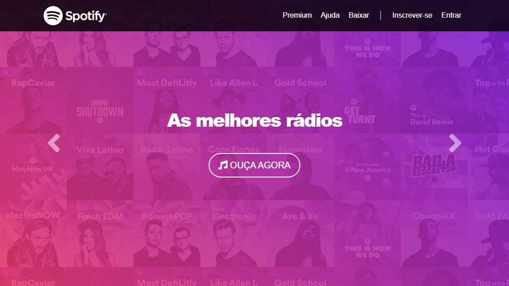
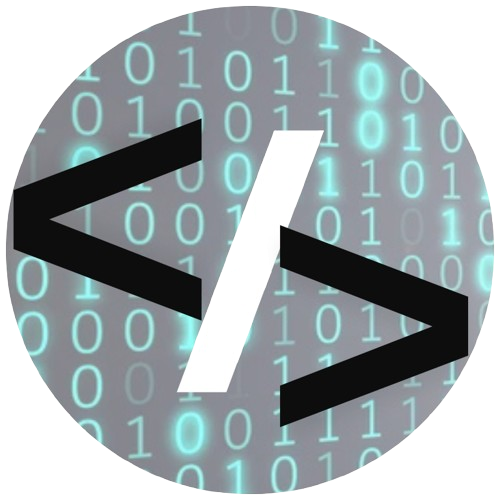

 # Spotify - Música para Todos 🎵 🎵

Bem-vindo ao nosso projeto de clone do Spotify! Este projeto é uma recriação da interface do Spotify, focada em apresentar uma experiência de usuário similar, com layout responsivo e funcionalidades básicas.

## Sobre o Projeto 🎧

Este projeto tem como objetivo recriar a interface do Spotify, utilizando HTML, CSS e JavaScript, com foco em responsividade e design. É um projeto ideal para praticar suas habilidades de desenvolvimento web e para entender melhor como funcionam aplicações web modernas.

O projeto apresenta:

*   **Layout Responsivo:** Uma interface que se adapta a diferentes tamanhos de tela, desde desktops até dispositivos móveis.
*   **Header e Menu de Navegação:** Uma barra de navegação funcional, com links para diferentes seções.
*   **Carrossel de Imagens:** Um carrossel interativo para exibir destaques e novidades.
*   **Seções de Conteúdo:** Áreas dedicadas para exibir músicas, playlists e informações sobre o serviço.
*   **Footer:** Um rodapé com links e informações importantes.

## Funcionalidades 🛠️

O Spotify implementa as seguintes funcionalidades principais:

1.  **Navegação:**
    *   Menu de navegação com links para as seções "Premium", "Ajuda", "Baixar", "Inscrever-se" e "Entrar".
    *   Botão de menu responsivo para dispositivos móveis.
2.  **Carrossel:**
    *   Carrossel de imagens com transições suaves.
    *   Botões de navegação "Anterior" e "Próximo".
3.  **Conteúdo:**
    *   Exibição de imagens de álbuns.
    *   Seções para exibir textos explicativos sobre músicas, playlists e novos lançamentos.
    *   Informações sobre o serviço em formato de texto.
4.  **Responsividade:**
    *   Layout que se adapta a diferentes tamanhos de tela.
    *   Utilização do framework Bootstrap para componentes responsivos.
5.  **Footer:**
    *   Rodapé com informações sobre a empresa, comunidades e redes sociais.
    *   Links para páginas importantes.
    *   Ícones de tecnologias utilizadas.

## Tecnologias Utilizadas ⚙️

Este projeto foi desenvolvido usando:

*   **HTML5:** Para a estrutura do site.
*   **CSS3:** Para o estilo e design.
*   **JavaScript:** Para a interatividade do carrossel e outras funções.
*   **Bootstrap:** Para o layout responsivo e componentes.
*   **Font Awesome:** Para ícones.
*   **Devicons:** Para ícones de tecnologia.

## Como Usar 🚀

Clique no botão abaixo para acessar:

   

## Código Fonte 💻

Para explorar o código-fonte e contribuir com o projeto, acesse:

[Repositório do Spotify](https://github.com/Domisnnet/spotify)

## Créditos 📝

*   **Desenvolvedor:** <strong>DomisDev.</strong>
*   **Design:** Inspirado na interface do Spotify, em uma versão mais antiga.
*   **Bibliotecas:** Bootstrap para estilos e componentes responsivos, Font Awesome para ícones.

## Contribuindo 🤝

Contribuições são sempre bem-vindas! Se você deseja contribuir com este projeto, siga estes passos:

    

       👐  Siga os passos para fortalecer este deck:
    

    <ul style="list-style-type: none; padding: 0; margin: 0;">
      <li style="margin-bottom: 10px;">
           1. 🍴 <a href="https://github.com/Domisnnet/spotify/fork" target="_blank" style="color: #1c7430; text-decoration: underline;">Faça um fork</a>: Adicione este projeto ao seu deck.
      </li>
      <li style="margin-bottom: 10px;">
          2. 🌿 Crie uma branch: Prepare suas atualizações. <a href="https://www.atlassian.com/br/git/tutorials/using-branches" target="_blank" style="color: #1c7430; text-decoration: underline;">Tutorial sobre Branches</a>
      </li>
      <li style="margin-bottom: 10px;">
          3. ✍️ Prepare seus commits: Guarde suas mudanças. <a href="https://www.atlassian.com/br/git/tutorials/saving-changes/git-commit" target="_blank" style="color: #1c7430; text-decoration: underline;">Tutorial sobre Commits</a>
      </li>
     <li style="margin-bottom: 10px;">
          4. 🚀 Envie: Lance sua sugestão (`git push origin minha-contribuicao`).
      </li>
      <li>
           5. ⚔️ <a href="https://github.com/Domisnnet/spotify/compare" target="_blank" style="color: #1c7430; text-decoration: underline;">Abra um Pull Request</a>: Desafie este deck original.
      </li>
      <li>
           6. 🐛 <a href="https://github.com/Domisnnet/spotify/issues" target="_blank" style="color: #1c7430; text-decoration: underline;">Reportar um problema/Sugestão (Issues)</a>
      </li>
    </ul>

## FAQ 🤔

**Pergunta 1:** Este projeto é uma cópia exata do Spotify?

   **Resposta:** Não, este projeto é um clone, em uma das suas versões, focado em recriar a interface visual e o layout do Spotify. Algumas funcionalidades podem não ser implementadas.

**Pergunta 2:** Posso usar este projeto como base para meus projetos?

   **Resposta:** Sim, o código está disponível no GitHub e você pode usá-lo como base para seus projetos, lembrando de dar os créditos apropriados.

**Pergunta 3:** Como posso entrar em contato com o desenvolvedor?

   **Resposta:** Você pode entrar em contato através do perfil do GitHub: 

<a href="https://github.com/Domisnnet">
    
    DomisDev
</a> 

---

Aproveite a experiência com nosso Spotify! 🎵